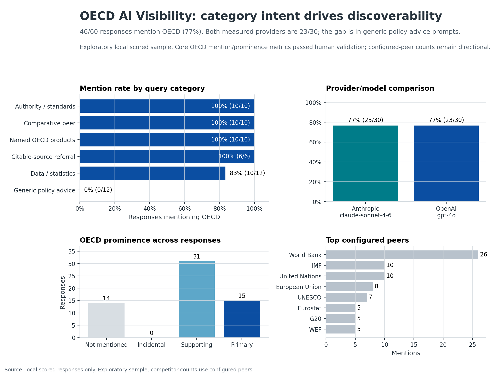
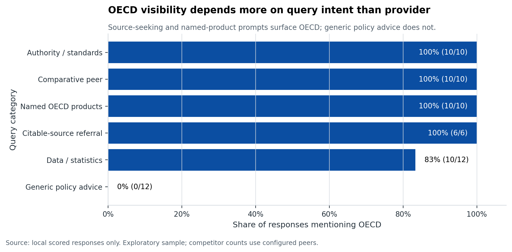
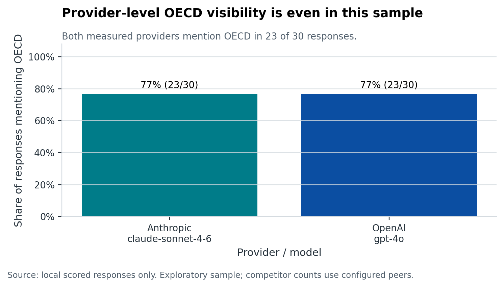
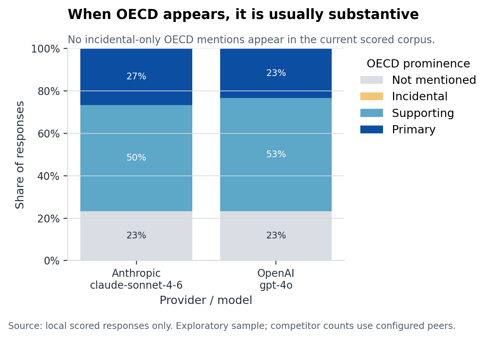
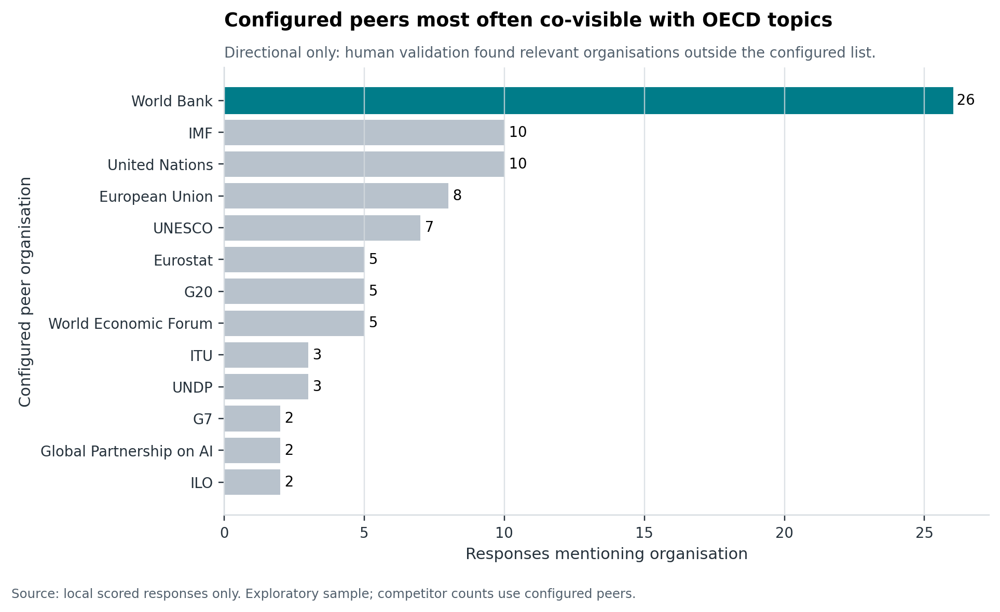

# Visual Gallery

This page is a compact portfolio and PDF companion for the OECD AI visibility figures. All visuals are regenerated from existing local scored data in `data/scored/scored_responses.csv`; no provider or judge calls are made.

Use the figures as a measured exploratory snapshot of 60 scored responses: two provider/model combinations, 30 designed OECD-relevant queries, and one run per provider/query. The core OECD mention and prominence metrics passed the human validation thresholds. Configured-peer counts remain directional because the human review found relevant organisations outside the configured peer list.

## One-Page Summary

[Open PNG](outputs/figures/oecd_visibility_summary.png)

**Read:** OECD appears in 46 of 60 responses, with equal overall mention rates for the two measured providers; the actionable pattern is by query intent, not provider.

**Caveat:** This is a designed pilot sample, not a representative measure of all OECD-relevant AI answers.

## Query Intent

[Open PNG](outputs/figures/oecd_mention_rate_by_category.png)

**Read:** Authority, comparative, named-product, and citable-source referral prompts surface OECD consistently in this sample; broad policy-advice prompts do not.

**Caveat:** Category rates reflect the current query design and one run per provider/query.

## Provider Comparison

[Open PNG](outputs/figures/oecd_mention_rate_by_provider_model.png)

**Read:** OpenAI `gpt-4o` and Anthropic `claude-sonnet-4-6` both mention OECD in 23 of 30 responses.

**Caveat:** This chart should not be read as a stable provider ranking without repeated runs, more models, and time-series measurement.

## Prominence

[Open PNG](outputs/figures/oecd_prominence_distribution.png)

**Read:** When OECD appears, it is usually a substantive part of the answer: supporting or primary, not incidental.

**Caveat:** Prominence is a validated heuristic label for visibility, not a judgement of factual quality, policy accuracy, or sentiment.

## Configured Peers

[Open PNG](outputs/figures/competitor_mention_frequency.png)

**Read:** World Bank is the most frequent configured peer in the current scored corpus, followed by IMF and United Nations.

**Caveat:** Peer counts only cover the configured taxonomy. Absence from this chart does not mean absence from the generated answers.
